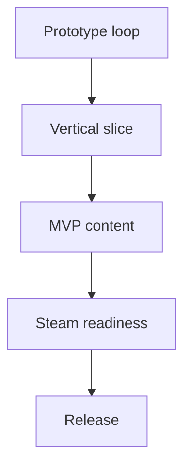

# Celestial Cats: Execution Plan (Solo, Unity, Steam)

## Goals
- Build a Windows-only Steam idle game with meme-forward humor.
- Use Unity with minimal paid assets, optional paid currency, and non-required monetization.

## 1) Environment setup
**Core tools**
- Install Unity Hub and Unity LTS (2D template).
- Install Visual Studio (Unity workload) or Rider.
- Install Git and enable Git LFS for large art/audio files.

**Project repo**
- Create a Git repo with `.gitignore` for Unity and `.gitattributes` for LFS.
- Folder structure:
  - `Assets/Art` 2D sprites and UI icons
  - `Assets/Audio` SFX and music
  - `Assets/Data` ScriptableObjects
  - `Assets/Systems` gameplay code
  - `Assets/UI` UI prefabs and screens

**Quality baseline**
- Set target FPS 60.
- Use TextMeshPro for all text.
- Establish a consistent pixel scale for UI and sprites.

## 2) Learning ramp for a beginner
- Unity basics: Scenes, Prefabs, GameObjects, ScriptableObjects.
- UI basics: Canvas, layout groups, anchors, TMP.
- Scripting basics: Update loop, events, ScriptableObject data.

**Mini milestones**
- Build a single screen UI with a counter and a button.
- Save and load a simple number locally.
- Add one ScriptableObject-driven upgrade.

## 3) Production phases and deliverables
**Phase A: Prototype loop**
- Implement Harmony production with a basic cat generator.
- Add upgrades and cost scaling.
- Add a 15 minute play loop with clear growth.

**Phase B: Vertical slice**
- Add 2 planets, 3 cats, 1 constellation.
- Add offline progress calculation.
- Add achievement boost system.

**Phase C: MVP content**
- Fill the MVP content list from the design doc.
- Add core UI screens and navigation.
- Add save system and data versioning.

**Phase D: Steam readiness**
- Integrate Steamworks for achievements.
- Build store assets and metadata.
- Create a public demo build.

## 4) Systems to build (technical scope)
- **EconomySystem**: currency tracking, costs, big number formatting.
- **ProductionSystem**: tick-based or fixed timestep production.
- **UpgradeSystem**: upgrade definitions and application rules.
- **PrestigeSystem**: reset and multiplier calculations.
- **OfflineProgressSystem**: time delta, cap rules.
- **AchievementSystem**: unlocks and permanent boosts.
- **SaveSystem**: local JSON save with versioning and backup.
- **UIController**: screen navigation and bindings.

## 5) Monetization strategy (Steam-appropriate)
**Reality check**
- Steam microtransactions are more complex than mobile IAP and often require backend services.
- For a solo beginner, consider shipping MVP without paid currency, but keep hooks in the economy for later.

**Recommended approach**
- Launch with optional paid cosmetics or a small DLC pack if you want revenue without backend.
- Design a premium currency system but keep it disabled until Steam microtransaction work is scoped.

**If paid currency is required later**
- Use Steam microtransactions via Steamworks and a secure server.
- Implement purchase verification and fraud prevention.

## 6) Steam release path (beginner friendly)
**Account and app setup**
- Create a Steamworks account and pay the app fee.
- Create an app, configure depots and builds.
- Set up store page and upload capsules and screenshots.

**Build pipeline**
- Generate Windows builds from Unity.
- Upload builds via Steamworks SDK tools.
- Test in Steam beta branch.

**Store page**
- Write the description, tags, and meme-forward copy.
- Create capsule art and feature a trailer or gameplay GIFs.

**Achievements**
- Implement achievements in Steamworks.
- Mirror in-game achievements with Steam achievements.

## 7) Unity Asset Store usage guidelines
**When to use assets**
- Use paid assets for UI polish, icon packs, and small animations.
- Avoid huge template frameworks that lock you into patterns.

**Checklist**
- Verify license allows commercial use on Steam.
- Keep an asset list for compliance.
- Prefab and integrate assets into your style guide.

## 8) Risks and mitigation
- **Scope creep**: enforce MVP content list and cut extra features.
- **Economy imbalance**: build data-driven tuning and run quick balance passes.
- **Steam monetization complexity**: ship MVP without paid currency, add later if needed.
- **Art polish vs budget**: reuse rigs and keep animation counts low.

## 9) Next actions
- Set up Unity project and repo.
- Build the prototype loop with one cat and one planet.
- Validate fun factor and clarity.

## Related design doc
- [`plans/celestial-cats-mvp-design.md`](plans/celestial-cats-mvp-design.md)
