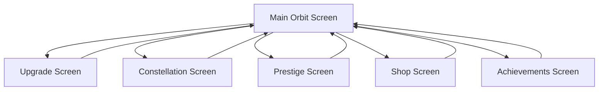
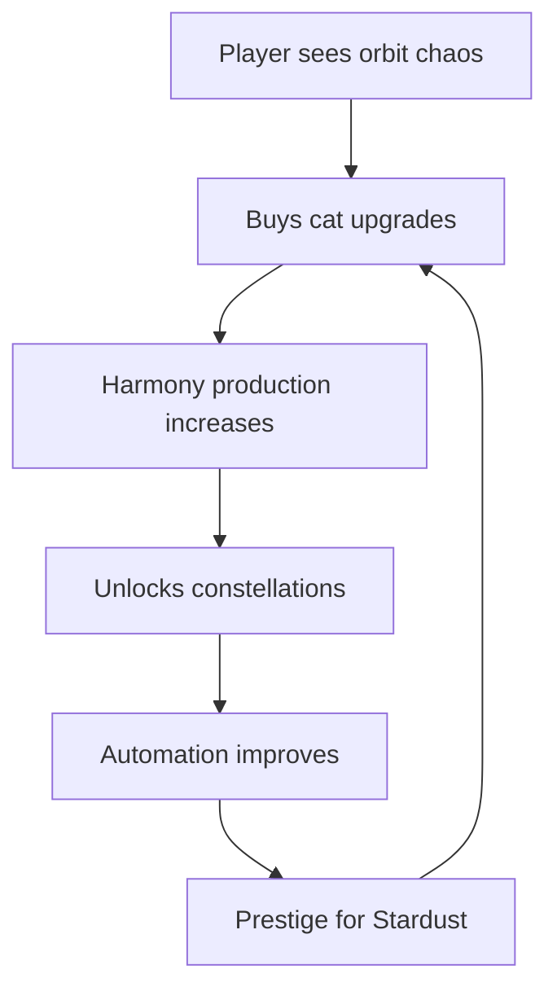

# Celestial Cats: Idle Orbit Harmonizer (MVP Design)

## 1) Game pillars, theme, player fantasy, and meme/viral humor
- **Pillar 1: Cozy cosmic stewardship** — Players feel like celestial caretakers using cats to harmonize chaotic orbits.
- **Pillar 2: Satisfying exponential growth** — Clear, readable growth with big-number humor.
- **Pillar 3: Meme-forward humor** — Snappy, shareable moments: absurd cat traits, planet names, and achievement popups.
- **Player fantasy** — I run the cosmic cat crew, turning chaos into harmony, and my decisions make the universe purr.

**Meme/viral hooks**
- Meme cat archetypes: Space Loaf, Gravity Goblin, Orbital Gremlin, Quantum Bean.
- Shareable moments: "The Moon finally forgives you" event popups; rare cat animations that are screen-record worthy.
- Over-the-top achievement names: "Purrpetual Motion", "Orbitflex", "Cataclysm Cancelled".
- Snackable lore: one-liners that can be screenshotted and shared.

## 2) Core idle loop
**Primary resources**
- **Harmony**: main production resource (like coins).
- **Stardust**: mid-tier crafting resource.
- **Purrgons**: premium currency (optional paid).

**Generators**
- **Cats** generate Harmony by tuning orbits.
- **Planets** scale cat output via orbit stability bonuses.
- **Constellations** unlock automation and global multipliers.

**Upgrades**
- Cat-level upgrades: per-cat multipliers, speed, and crit chance.
- Planet upgrades: orbit stability, harmony multiplier, event frequency.
- System upgrades: global bonuses, automation, offline cap increases.

**Balance hooks**
- Softcaps with diminishing returns on single-currency hoarding.
- Milestones that unlock new multipliers rather than raw % only.
- Idle/active hybrid: active taps trigger brief "Orbit Align" burst.

**Subtle MTX nudges (not required)**
- Optional time-savers: temporary harmony booster and faster automation queue.
- Cosmetic cat skins with small non-stackable quality-of-life perks.
- Gentle gating: premium currency unlocks convenience, not progression locks.

## 3) Progression structure
- **Stage 1: Solar Nursery** — 3 starter planets, basic cats, core loop tutorial.
- **Stage 2: Nebula Academy** — unlock constellation system and auto-upgrades.
- **Stage 3: Pulsar District** — first prestige layer, add stardust crafting.
- **Stage 4: Galaxy Conservatory** — long-term goals and legendary cats.

**Prestige**
- **Harmony Reset**: reset Harmony for Stardust multipliers.
- **Constellation Ascend**: rare reset for global boosts and automation slots.

**Long-term goals**
- Complete constellation sets.
- Unlock legendary orbit cats with unique behaviors.
- Achieve perfect orbit stability on all planets.

## 4) Economy details
**Currencies**
- **Harmony**: main spend resource.
- **Stardust**: prestige-earned, spent on global multipliers.
- **Purrgons**: premium, optional, used for boosts and cosmetics.

**Sinks**
- Cat upgrades, planet upgrades, automation slots, constellation unlocks.

**Inflation control**
- Exponential costs on higher tiers.
- Milestone unlocks shift power to new systems.
- Softcaps on single-upgrade stacking.

**Automation**
- Auto-level rules: prioritize lowest ROI cat first.
- Offline gain scales with orbit stability and automation tier.

## 5) Offline progress model
- Base: 8 hours offline progress, extended to 24 with upgrades.
- Offline multiplier: 25%–80% of online depending on automation tier.
- Catch-up cap: no more than 2x current online production rate.

## 6) Achievements (production boost)
- Achievements provide small permanent production boosts.
- Each tier: +1% to +5% global harmony.
- Meme-rich descriptions for shareable virality.

## 7) UI flow and key screens
**Screens**
- Main Orbit Screen: core loop, visible cats and planets.
- Upgrade Screen: cats, planets, system upgrades tabs.
- Constellation Screen: unlocks and automation rules.
- Prestige Screen: reset info and benefits.
- Shop Screen: cosmetics, boosts, Purrgons.
- Achievements Screen: progress and rewards.

## 8) Monetization plan
- F2P with optional Purrgons.
- No paywalls or mandatory currency sinks.
- Paid currency used for: cosmetics, time-savers, and soft-convenience.
- Clear messaging: "Optional cosmic help" not required to progress.

## 9) MVP content set
**Cats**
- 12 cats: 8 common, 3 rare, 1 legendary.

**Planets**
- 6 planets with unique orbit quirks.

**Upgrades**
- 30 cat upgrades, 20 planet upgrades, 10 system upgrades.

**Events**
- 6 random events (meteor rush, moon mood, orbit drift).

**Milestones**
- 20 milestones that unlock new mechanics.

## 10) Unity architecture
**Core modules**
- GameState: central state machine.
- EconomySystem: currency and cost formulas.
- CatSystem: cat definitions and production ticks.
- PlanetSystem: stability and multipliers.
- OfflineProgressSystem: timestamp tracking and gain calculation.
- AchievementSystem: triggers and rewards.
- StoreSystem: IAP and cosmetic inventory.
- UIController: navigation and data binding.

**Data-driven setup**
- ScriptableObjects for cats, planets, upgrades, events.

## 11) Production plan for solo low-budget
- **Art**: 2D icons, few high-polish animations for rare cats/events.
- **Animation**: use Spine or Unity Animator with shared rigs.
- **Audio**: free/low-cost loops; minimal SFX for key actions.

## 12) Risks and validation
**Risks**
- F2P expectations on Steam can be mixed.
- High polish animation scope vs solo budget.
- Economy balancing complexity.

**Validation steps**
- Prototype core loop and check retention of 15-minute session.
- A/B test upgrade pacing and achievement boosts.
- Wishlist-driven alpha with feedback on humor and clarity.

